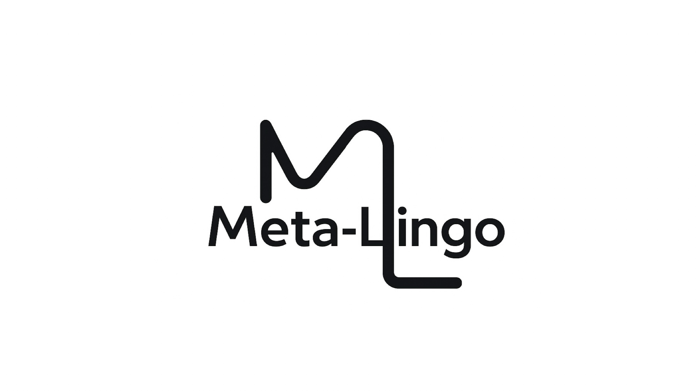

<p align="center">
  
</p>

<h1 align="center">Meta-Lingo</h1>

<p align="center">
  <strong>A Modern Multimodal Corpus Research Software</strong>
</p>

<p align="center">
  <a href="#features">Features</a> |
  <a href="#installation">Installation</a> |
  <a href="#quick-start">Quick Start</a> |
  <a href="#documentation">Documentation</a> |
  <a href="#license">License</a>
</p>

<p align="center">
  
  
  
</p>

<p align="center">
  <a href="https://huggingface.co/tommyleo2077"></a>
  <a href="https://space.bilibili.com/294707614"></a>
  <a href="https://xhslink.com/m/9z8ubyF4b4N"></a>
  <a href="https://v.douyin.com/euiu1OJ9jB4/"></a>
  <a href="mailto:1683619168tl@gmail.com"></a>
</p>

---

## Overview

**Meta-Lingo** is a comprehensive desktop application designed for corpus linguistics research. Built with modern technologies (Electron + React + Python FastAPI), it provides powerful tools for multimodal corpus management, linguistic analysis, and annotation.

<p align="center">
  
</p>

## Features

### Corpus Management
- **Multimodal Support**: Text, audio, and video files with drag-and-drop upload
- **Audio Transcription**: Whisper Large V3 Turbo with word-level timestamps
- **Forced Alignment**: Wav2Vec2 word-level alignment for English audio (automatic)
- **Pitch Extraction**: TorchCrepe F0 extraction for English audio (automatic)
- **Video Analysis**: YOLOv8 object detection and CLIP semantic classification
- **Automatic Annotation**: SpaCy NLP (POS/NER/Dependency), USAS semantic domains, MIPVU metaphor identification
- **Metadata Management**: Language, author, source, text type with tag system

### Analysis Tools

| Module | Description |
|--------|-------------|
| **Word Frequency** | Frequency analysis with POS filtering, lemma/word form selection, visualization |
| **N-gram Analysis** | 2-6 gram support, nested grouping, Sankey diagrams |
| **Keyword Extraction** | TF-IDF, TextRank, YAKE!, RAKE, and 9 keyness statistics methods |
| **Collocation** | KWIC search with 6 modes, CQL query language, CQL Builder |
| **Synonym Analysis** | WordNet integration with network visualization |
| **Semantic Domain** | USAS-based analysis with dual view (by domain/by word) |
| **Metaphor Analysis** | MIPVU-based detection; 3-step pipeline (word filter → rules → Clause model); source color-coding by POS |
| **Word Sketch** | Grammar pattern analysis (50 relations), logDice scoring, difference comparison |
| **Topic Modeling** | BERTopic, LDA, LSA, NMF with dynamic topic analysis |
| **Bibliography** | Refworks parsing (WOS/CNKI), shadow corpus for abstracts, network visualization, burst detection; analysis modules support corpus/literature toggle and library selection (all / by keyword / manual). |

### Annotation Mode
- **Text Annotation**: Sentence-level display, intelligent segmentation, batch annotation
- **Multimodal Annotation**: Video frame tracking, DAW-style timeline, YOLO overlay
- **Audio Waveform Annotation**: Wavesurfer.js waveform visualization with word alignment, pitch curve overlay, box drawing annotation (English audio only)
- **Framework Management**: 49 preset frameworks (SFL, UAM, etc.), custom framework support
- **Inter-coder Reliability**: Fleiss' Kappa, Cohen's Kappa, Krippendorff's Alpha, Gold Standard support (plain text archives only)
- **Syntax Visualization**: Constituency and dependency parsing

### Additional Features
- **Dictionary Lookup**: Macmillan, Longman Collocations with fuzzy search
- **Bilingual Interface**: Chinese and English with real-time switching
- **Custom Wallpaper**: Personalized application background
- **Export Options**: CSV, PNG, SVG for all visualizations

## System Architecture

```
+----------------------------------------------------------+
|                      Meta-Lingo                           |
+----------------------------------------------------------+
|  Frontend (Electron + React + TypeScript)                 |
|  - Material-UI components                                 |
|  - Zustand state management                               |
|  - D3.js / Plotly.js visualizations                       |
|  - i18next internationalization                           |
+----------------------------------------------------------+
|                    HTTP REST API                          |
+----------------------------------------------------------+
|  Backend (Python FastAPI)                                 |
|  - SpaCy NLP processing                                   |
|  - USAS semantic tagging (PyMUSAS)                        |
|  - MIPVU metaphor detection (DeBERTa)                     |
|  - BERTopic / LDA / LSA / NMF topic modeling              |
|  - Whisper / YOLO / CLIP multimodal analysis              |
+----------------------------------------------------------+
|  Data Storage                                             |
|  - SQLite database (metadata)                             |
|  - File system (corpora, annotations)                     |
+----------------------------------------------------------+
```

## Tech Stack

### Frontend
| Technology | Purpose |
|------------|---------|
| Electron 28+ | Desktop application framework |
| React 18 | UI framework |
| TypeScript 5 | Type safety |
| Material-UI 5 | Component library |
| D3.js 7 | Data visualization |
| Plotly.js | Interactive charts |

### Backend
| Technology | Purpose |
|------------|---------|
| Python 3.12 | Runtime environment |
| FastAPI | Web framework |
| SpaCy 3.8+ | NLP processing |
| PyMUSAS | Semantic tagging |
| BERTopic | Topic modeling |
| Transformers | Whisper/CLIP models |
| Ultralytics | YOLOv8 |

## Installation

### Download

Visit our official website to download the latest version:

**[https://tltanium.github.io/meta-lingo-website/](https://tltanium.github.io/meta-lingo-website/)**

### Build from Source

#### Prerequisites
- Node.js 18+
- Python 3.12
- Conda (recommended)
- FFmpeg

#### Steps

1. **Clone the repository**
```bash
git clone git@github.com:TLtanium/meta-lingo-electron.git
cd meta-lingo-electron
```

2. **Create Conda environment**
```bash
conda create -n meta-lingo-electron python=3.12 -y
conda activate meta-lingo-electron
```

3. **Install dependencies**
```bash
# Backend
pip install -r requirements.txt

# Frontend
npm install
```

4. **Download ML models**

Place the following models in the `models/` directory:
- `whisper-large-v3-turbo`
- `yolov8`
- `clip-vit-large-patch14`
- `paraphrase-multilingual-MiniLM-L12-v2`
- SpaCy models (`en_core_web_lg`, `zh_core_web_lg`)

## Quick Start

### Development Mode

**One-click start (macOS):**
```bash
./start.sh
```

**Manual start:**

Terminal 1 - Backend:
```bash
conda activate meta-lingo-electron
cd backend
uvicorn main:app --host 0.0.0.0 --port 8000 --reload
```

Terminal 2 - Frontend:
```bash
npm run dev
```

Access the application at: **http://localhost:5173**

### Build for Production

**macOS:**
```bash
./build.sh
```

**Windows:**
```cmd
build.bat
```

Output will be in the `release/` directory.

## Documentation

- **In-app Help**: Access via the Help module with bilingual documentation
- **API Documentation**: http://localhost:8000/docs (when backend is running)

## API Overview

| Category | Endpoints |
|----------|-----------|
| Corpus | `/api/corpus/*` - CRUD, upload, annotation |
| Analysis | `/api/analysis/*` - Word frequency, N-gram, keywords, etc. |
| Collocation | `/api/collocation/*` - KWIC search, CQL parsing |
| Topic Modeling | `/api/topic-modeling/*` - BERTopic, LDA, LSA, NMF |
| Annotation | `/api/annotation/*`, `/api/framework/*` |
| Word Sketch | `/api/sketch/*` - Grammar patterns, difference |
| Bibliography | `/api/biblio/*` - Libraries, visualization |

Full API documentation available at `/docs` endpoint.

## Models & Resources

Meta-Lingo integrates several pre-trained models:

| Model | Purpose | Source |
|-------|---------|--------|
| Whisper Large V3 Turbo | Audio transcription | OpenAI |
| Wav2Vec2-base-960h | Forced alignment (English) | Facebook |
| TorchCrepe Full | Pitch extraction (F0) | [maxrmorrison/torchcrepe](https://github.com/maxrmorrison/torchcrepe) |
| YOLOv8 | Object detection | Ultralytics |
| CLIP ViT-Large-Patch14 | Image classification | OpenAI |
| SpaCy en/zh_core_web_lg | NLP processing | Explosion |
| DeBERTa-v3-large-clause-metaphor | MIPVU metaphor detection (F1 75.83) | [tommyleo2077](https://huggingface.co/tommyleo2077/deberta-v3-large-clause-metaphor) |
| Sentence-BERT | Text embeddings | sentence-transformers |

## Contributing

This project is currently maintained for academic research purposes. For bug reports or feature requests, please open an issue.

## Changelog

### v3.9.56 (2026-03-07)
- **Metaphor Analysis — Clause-only pipeline**: Removed HiTZ model entirely. All tokens now annotated by a single `deberta-v3-large-clause-metaphor` model using full-sentence context (max_length=192). 3-step pipeline: word-form filter → SpaCy rule filter → Clause model. Function words (IN/DT/RB/RP) keep orange tag (`finetuned`); other words use green tag (`clause`). Legacy `hitz` source in existing annotations treated as `clause` (green). Help docs updated with Clause model accuracy (Precision 78.08%, Recall 73.69%, F1 75.83; DT F1 90.87, IN F1 87.87).

### v3.9.55 (2026-03-07)
- **Sentiment Analysis — USAS mode**: Search panel adds "USAS Semantic Domain" mode; results aggregate sentiment scores by domain code with full domain name tooltip; word cloud uses domain names; CSV export adds `domain_name` column.

### v3.9.54–v3.9.51 (2026-03-06)
- **Bibliography Visualization**: PDF export rewritten via Electron IPC (`printToPDF`) to fix blank-page issue on large documents. Paper column with PDF upload and first-page thumbnail. 11 AI-generated fields per entry (research goal, questions, design, conclusions, mechanism, contribution, limitations, value, dialogue, future work, summary). Batch AI generation for multiple entries. Column visibility control. Export to styled PDF report.

### v3.9.46 (2026-03-04)
- **Sentiment Analysis (NRC)**: Full NRC-EmoLex annotation added to corpus pipeline after MIPVU. New analysis page with polarity (pie chart + word cloud) and emotion dimensions (radar chart + word cloud). Result table cross-links to collocation/word sketch/N-gram/semantic domain. Backend: `nrc_service.py`, `sentiment_analysis_service.py`, `POST /api/analysis/sentiment`.

### v3.9.44–v3.9.45 (2026-03-02)
- Cross-module links default to case-insensitive search. Collocation wordlist search mode (multi-word input, one per line).

### v3.9.43 (2026-03-02)
- **Bibliography**: Bulk delete for selected entries. Relevance rating (0–5 stars), tags, and notes columns added to entry table and detail dialog. CSV export.

### v3.9.36 (2026-02-27)
- **Metaphor Analysis**: Added Clause model (`deberta-v3-large-clause-metaphor`) to MIPVU pipeline for function-word annotation. POS-group statistics (IN/DT/RB/RP/OTHER metaphor rates) shown in results table header.

### v3.9.34–v3.9.35 (2026-02-26–27)
- Cross-module corpus selection sync across all analysis modules. Topic modeling bibliography mode with publication year for dynamic analysis.

### v3.9.27–v3.9.33 (2026-02-24–26)
- **AI Assistant**: Robot icon in all analysis modules' left panel (requires Ollama or OpenAI-compatible API); sends current page state as context. OpenAI-compatible API support in Settings (address / key / model). Cross-module library-mode link sync fixes.

### v3.9.22–v3.9.26 (2026-02-24)
- Semantic domain analysis: CQL cross-link, word cloud, domain name display. Collocation network expand on click, MinSense fix, Word Sketch Difference word-form/lemma mode. Topic modeling: N-gram preprocessing mode, LDA/LSA/NMF dynamic topic analysis.

### v3.9.15–v3.9.18 (2026-02-17–22)
- **Praat acoustic analysis**: Spectrogram, formants (F1–F5), intensity, HNR, jitter, shimmer. Chinese audio full visualization support. Corpus building script (`saves/corpus/corpus_building.py`) for 13 English corpora.

### v3.9.0–v3.9.14 (2026-02-08–16)
- Ridge plot SVG/PNG full export, CQL top-level OR operator and template auto-fill. Collocation search mode (lemma/word form). Result table search fix across all modules. Unified UI spacing and labeling. Cross-module N-gram link.

### v3.8.96–v3.8.99 (2026-01-28–2026-02-08)
- Audio waveform annotation (Wavesurfer.js + TorchCrepe pitch + box drawing). Full annotation pipeline for audio/video transcripts. Inter-coder reliability gold standard fix. CQL distance selector fix.

### v3.8.86–v3.8.95 (2026-01-18–28)
- LLM topic naming (Ollama). USAS annotation modes (rule / neural / hybrid). Stopword removal (20+ languages). Custom wallpaper. Keyword extraction enhancements. Theme/Rheme auto-annotation. Dark theme for all topic modeling visualizations.

For the full version history, see [PROJECT.md](PROJECT.md) or the Git commit log.

## License

**Meta-Lingo Software License (Non-Commercial)**

Meta-Lingo is an independently developed corpus research software by Tommy Leo, protected under the Copyright Law of the People's Republic of China.

This software is licensed only for:
- Personal learning
- Academic research
- Non-commercial corpus analysis and linguistic research

Commercial use is prohibited without written permission.

See [LICENSE_CN.txt](LICENSE_CN.txt) (Chinese) or [LICENSE_EN.txt](LICENSE_EN.txt) (English) for full terms.

---

<p align="center">
  <strong>Copyright 2026 Tommy Leo. All rights reserved.</strong>
</p>
